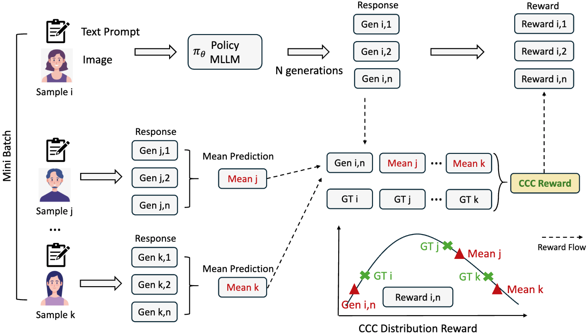
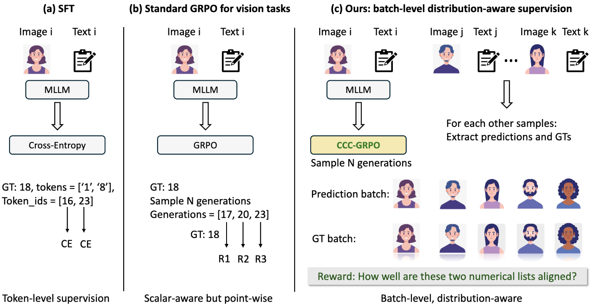
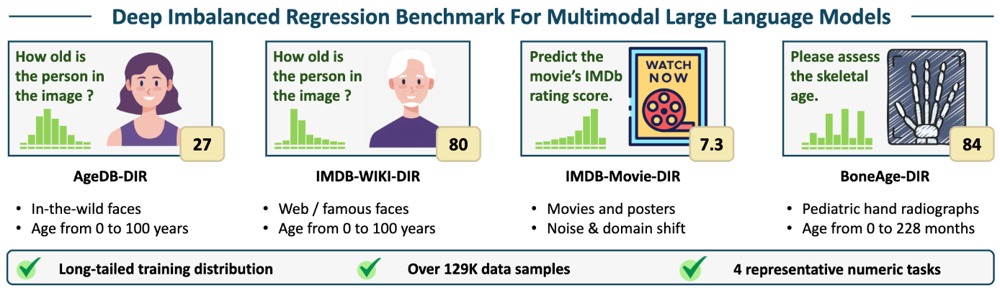

# CCC-GRPO

This repository contains PyTorch implementation of "[Injecting Distributional Awareness into MLLMs via Reinforcement Learning for Deep Imbalanced Regression (ICML 2026)](https://arxiv.org/abs/2605.01402)".


Created by [Du Yao](https://duyao-art.github.io/), [Song Shanshan](https://scholar.google.com.hk/citations?hl=zh-CN&user=3I5VuhUAAAAJ), [Li Xiaomeng](https://xmengli.github.io/)\*


## Overview of CCC-GRPO
We formulate deep imbalanced regression in MLLMs as a distribution-aware reinforcement learning problem.

Our formulation emphasizes batch-level relational supervision as the key to mitigating regressionto-the-mean behavior.

<p align="center">
     <br>
  


## Comparison of training paradigms for numerical prediction in MLLMs. 

We present the first systematic study of DIR under the MLLM paradigm, demonstrating that point-wise numerical supervision—whether via SFT or per-sample regression rewards—fails to
capture the global structure of long-tailed continuous targets. 


<p align="center">
     <br>

Left: SFT treats regression as token-level classification.

Middle: Standard GRPO applies point-wise scalar rewards to each generation. 

Right: CCC-GRPO introduces batch-level, distributionaware relational supervision.


## Overview of the constructed DIR benchmark for MLLMs.

We reconstruct all datasets into a unified DIR benchmark tailored for MLLMs, where models are required to generate continuous values via token-based decoding under naturally skewed training distributions. In total, the benchmark covers over 129K samples. 




## Citation
If you find this codebase helpful, please consider to cite:

```
@misc{du2026injectingdistributionalawarenessmllms,
      title={Injecting Distributional Awareness into MLLMs via Reinforcement Learning for Deep Imbalanced Regression}, 
      author={Yao Du and Shanshan Li and Xiaomeng Li},
      year={2026},
      eprint={2605.01402},
      archivePrefix={arXiv},
      primaryClass={cs.CL},
      url={https://arxiv.org/abs/2605.01402}, 
}
```
